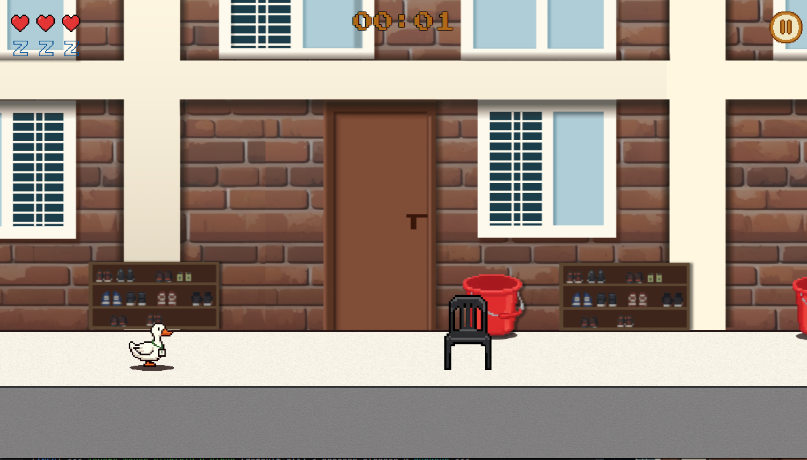
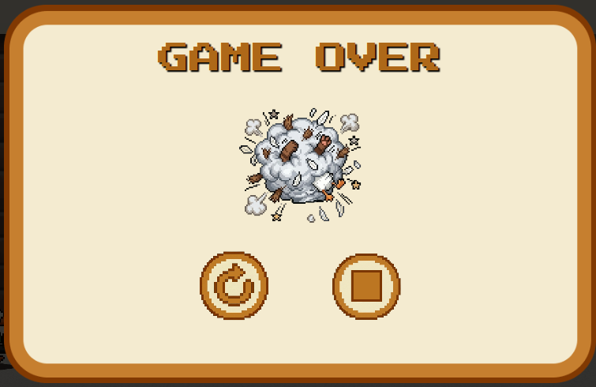

# 🦆 Duck Dash


[](https://github.com/MdRasB/Duck_Dash/actions/workflows/build.yml)

**Duck Dash** is a high-octane, 2D side-scrolling runner built with JavaFX. Players control a determined duck navigating through a challenging environment filled with obstacles, enemies, and power-ups. Manage your health and sleep levels while dashing through levels to achieve the highest score!

---

## 🎮 Features

*   **Dynamic Game Loop:** Smooth 60FPS gameplay powered by JavaFX AnimationTimer with delta-time calculation for frame-rate independent movement.
*   **Complex Entity System:** Includes a variety of obstacles (Chairs, Bottles), enemies (Cats, Eagles, Worms), and collectibles (Bread).
*   **Resource Management:** Custom AssetLoader with an intelligent caching system and preloading to ensure zero-lag gameplay.
*   **Interactive HUD:** Real-time tracking of Health and Sleep bars, along with a persistent game timer.
*   **State-of-the-art UI:** Polished menus including Story Mode, Level Selection, Settings, and a Pause system.
*   **Responsive Controls:** Precision jumping and crouching mechanics to dodge multi-level threats.

---

## 🛠 Tech Stack

*   **Language:** Java 21
*   **Framework:** JavaFX 21
*   **Build Tool:** Maven
*   **Media Handling:** JavaFX Media API for SFX and Music

---

## 🚀 Getting Started

### Prerequisites

*   JDK 17 or higher installed.
*   Maven 3.8+ installed.
*   (Optional) An IDE like IntelliJ IDEA or VS Code.

### Installation & Running

* Go to the release page: [RELEASE](https://github.com/MdRasB/Duck_Dash/releases).
* Chose the suitable executable file for your OS.
* If ```os=windows``` then download & install ```.exe``` file. After installing and running it, a new folder will generate in ```C:\Program Files```. Then select DuckDash and run the application.
* If ```os=linux(.deb supported)``` then download and isntall ```.deb``` file.
* If you want to add repo, follow the instruction below

1.  **Clone the Repository:**
    ```bash
    git clone https://github.com/MdRasB/Duck_Dash.git
    cd Duck_Dash
    ```

2.  **Build the Project:**
    ```bash
    mvn clean install
    ```

3.  **Launch the Game:**
    ```bash
    mvn javafx:run
    ```

---

## 🕹 Controls

| Action | Key / Input |
| :--- | :--- |
| **Jump** | `Space` / `Up Arrow` / `W` |
| **Crouch** | `Down Arrow` / `S` |
| **Pause** | `P` / `Esc` / On-screen Button |
| **Menu Navigation** | Mouse Click |

---

## 📂 Project Structure

```text
src/main/java/edu/bauet/java/cse/duckrun/
├── core/         # Game engine, loop logic, and global constants.
├── entities/     # Player, Enemy, Obstacle, and Item classes.
├── levels/       # Level definitions and spawning logic.
├── scenes/       # Screen management (Menu, Game, Story, Game Over).
├── ui/           # Custom UI components (HealthBar, Menus).
└── utils/        # Asset loading, collision detection, and timers.
```

---

## 🧭 Interactive Flowchart

The full project flow is documented in `PROJECT_FLOWCHART.md`, and can be viewed interactively (pan/zoom + export) here:

- `docs/duckrun_flowchart_v2.html` (generated from `PROJECT_FLOWCHART.md`)
- Regenerate anytime: `scripts/generate_flowchart_viewer.sh`
- See the flowchart : [Flowchart_1](https://rawcdn.githack.com/MdRasB/2D_Duck_in_Bauet/refs/heads/r_flow/docs/duckrun_flowchart_v2.html)
- See the flowchart : [Flowchart_2](https://rawcdn.githack.com/MdRasB/2D_Duck_in_Bauet/refs/heads/r_fl_2/docs/flowchart.html)


---

## 🖼️ Screenshots

### Main Menu


### In-Game Action



---

## 🤝 Contributing

Contributions are what make the open-source community such an amazing place to learn, inspire, and create.

1.  Fork the Project.
2.  Create your Feature Branch (`git checkout -b feature/AmazingFeature`).
3.  Commit your Changes (`git commit -m 'Add some AmazingFeature'`).
4.  Push to the Branch (`git push origin feature/AmazingFeature`).
5.  Open a Pull Request.

---

## 📜 License

Duck Dash - simple runner game<br>
Copyright (C) 2026-present Duck Dash Team

This program is free software: you can redistribute it and/or modify it under the terms of the GNU General Public License as published by the Free Software Foundation, either version 3 of the License, or (at your option) any later version.

This program is distributed in the hope that it will be useful, but WITHOUT ANY WARRANTY; without even the implied warranty of MERCHANTABILITY or FITNESS FOR A PARTICULAR PURPOSE. See the GNU General Public License for more details.

You should have received a [copy](LICENSE.txt) of the GNU General Public License along with this program. If not, see <https://www.gnu.org/licenses/>.

---

## 👥 Team

<table>
  <tr>
    <td align="center">
      <a href="https://github.com/MdRasB">
        <br/>
        <sub><b>MdRasB</b></sub>
      </a>
    </td>
    <td align="center">
      <a href="https://github.com/Shabab47">
        <br/>
        <sub><b>Shabab</b></sub>
      </a>
    </td>
    <td align="center">
      <a href="https://github.com/aa-jim">
        <br/>
        <sub><b>Jim</b></sub>
      </a>
    </td>
  </tr>
</table>

---

## ✉️ Contact

Project Link: [Duck Dash](https://github.com/MdRasB/Duck_Dash)

Developed with ❤️ by the **Duck Dash Team**.
