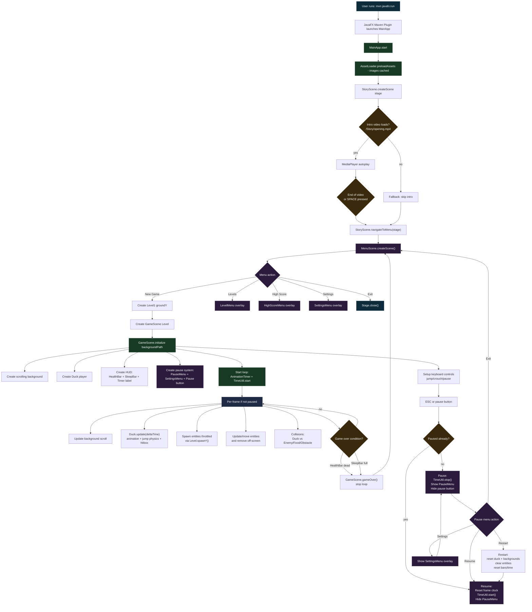
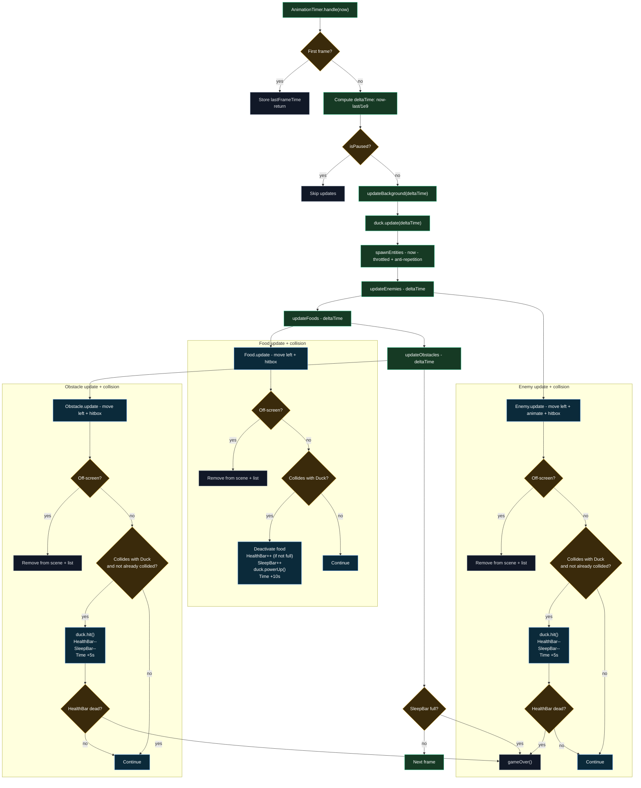
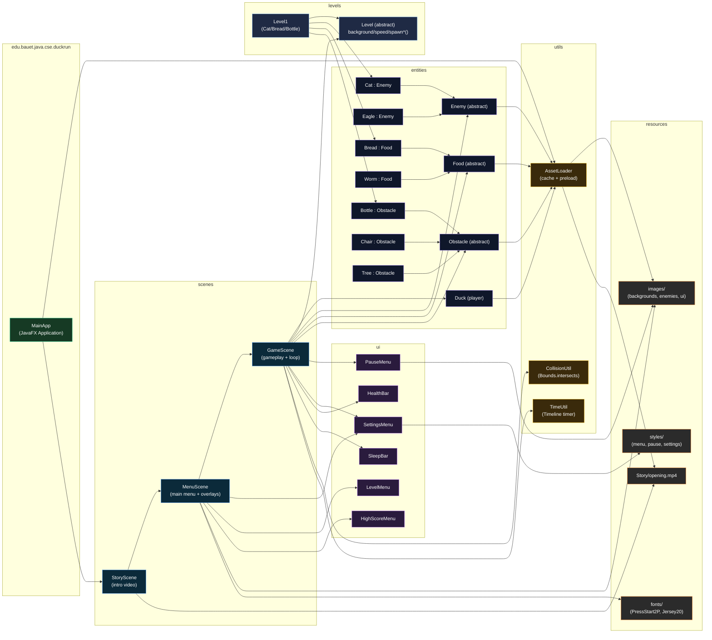

# DuckRun (Duck Dash) - Project Flowchart

This document provides a formal, end-to-end flowchart of the DuckRun project: startup, scene navigation, the gameplay loop, entity spawning, collision outcomes, and the main code/package architecture.

Build/run context: Maven + JavaFX (`pom.xml` points to `edu.bauet.java.cse.duckrun.MainApp`).

## Runtime Workflow (Screens + Game Lifecycle)

## Game Loop Detail (Per-Frame Update and Collision Outcomes)

## Code/Package Architecture (How Modules Connect)

## Notes (What’s Implemented vs Placeholder)

- `Level1` is the active level wired from `MenuScene` and spawns `Cat`, `Bread`, `Bottle`.
- `Eagle`, `Worm`, `Chair`, `Tree` exist as entity classes but are not currently spawned by `Level1`.
- The following files are currently empty stubs (present but contain no code): `core/Constants.java`, `core/GameLoop.java`, `core/GameState.java`, `scenes/GameOverScene.java`, `ui/HUD.java`.
- Resource-path hygiene: `Chair` references `/images/obstacles/chair.png` and `Tree` references `/images/obstacles/tree.png`, but those files are not present under `src/main/resources` (current obstacle assets are `Chair_wood.png`, `chair_black.png`, etc.).
